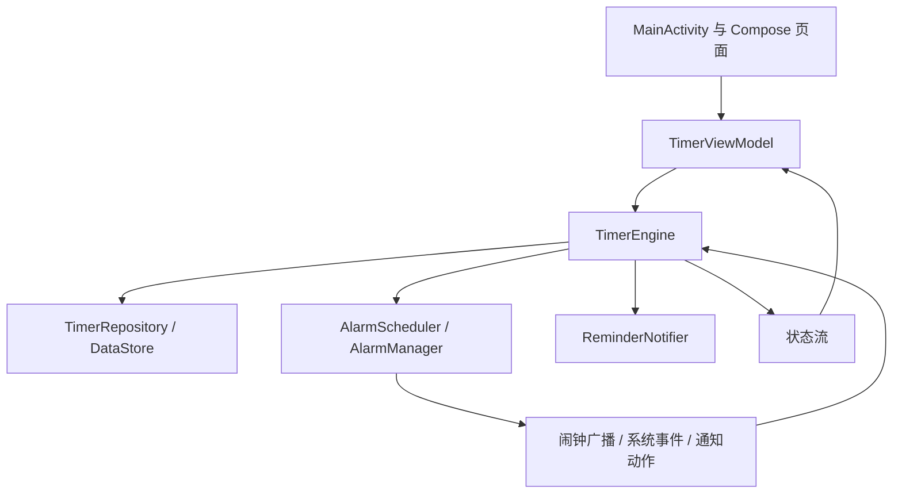

休息一下 Wear OS 原生程序分析与修复记录

**2026-09-23 结构优化后的当前结论（P1–P5 本地完成）**

依据 AGENTS 的 Codex 可读性与功能模块化原则，仍保留一个 app 模块及原有计时事务边界。本轮由单一代理执行，没有调用子代理，没有安装或操作手表。

- 提醒能力统一为读取器 → 不可变快照 → ReminderPolicy；命令前置检查、诊断和直接振动共用规则。渠道 LOW/MIN、勿扰和全屏限制明确区分，状态读取失败不默认就绪。
- 工作与休息改为独立单字段命令，获锁后合并最新有效状态；两个旧值覆盖场景先确定性复现，再由回归测试确认修复。
- 阶段和恢复时钟计算提取为纯规则；业务恢复按 TimerFailure 判断，不解析中文错误。新增稳定字符串 failure_reason，旧 ERROR 缺少或未知代码映射 UNKNOWN，保留手动重试。真实文件 DataStore 的保存、关闭、重开和残留字段兼容均已验证。
- TimerScreen 只组合状态与回调，水波、内容、控制和弹窗各自定位；ViewModel 通过 Factory 注入四项依赖，对外状态只读，页面统一消费 ActionFeedback。
- ReminderNotifier 只提供正式提醒和清理接口；ReminderSelfTest 承接手动自检，两者共用 ReminderVibration 的请求路径。Android 实现与接口分文件；全部清理取消振动，旧会话定向清理不取消新会话振动。
- 共用 Fake 与能力夹具迁至测试支持目录。原 67 项测试方法全部保留；自检测试类更名为 ReminderSelfTestBehaviorTest，八个原用例及断言保留。

最终本地验证：166 项测试通过，0 失败、0 错误、0 跳过；独立调试 APK 构建成功；Lint 0 错误、34 警告。新增 99 项验证分别为能力策略 73、时长竞态 6、规则与真实持久化 13、ViewModel 7。Lint 警告分类为 UnusedResources 14、WearRecents 13、GradleDependency 3、ObsoleteSdkInt 2、ObsoleteLintCustomCheck 1、MonochromeLauncherIcon 1。

验证日志位于 app/build/p1-validation.log、p2-validation.log、p3-validation.log、p4-validation.log、p5-validation.log；最终报告路径见 README。阶段提交及待办见 IMPLEMENTATION_PLAN。测试覆盖方法名已与 ee40b31 对照，无丢失；仅文件搬移没有增加镜像测试。

边界：用户要求“你先完成重构，真机测试等下”。新版未安装；能力读取器的 Android 字段映射、四态视觉/模态交互和新 APK 的手动及两次自动振动仍待真机。历史触感结果不能替代新版验收。API 30–32 的音频属性分支保留且已编译，未在旧设备实测。停止记录、会话 URI、通知 action、渠道 ID 和原持久化键保持兼容，事务取消与恢复回归全部通过。

**以下是 ee40b31 对应的历史修复与真机结果，保留供追溯；旧行号、代码规模和报告链接不代表当前源码位置。**

**2026-09-23 修复结果**

本次修改仅针对 `C:/php/3/TakeABreak_WearOS` 原生程序。已有的设置页、提醒状态页和主页面调整保留。

- 通知暂停、继续、停止共用真实 action 常量；缺失会话被拒绝，状态可读时拒绝过期会话。PendingIntent 使用会话 URI 区分，防止新通知覆盖旧通知中的会话参数。
- 引擎状态流只发布串行命令维护的有效状态；不再使用仓库的迟到快照覆盖内存 ERROR/STOPPED。
- 启动、暂停、继续、停止、阶段切换和系统对账在获得锁后完成取消安全的提交或补偿；已经开始的事务不受 UI 协程取消中断，等待锁时仍允许取消。存储和系统副作用在 IO 调度器运行。
- 新增独立的同步停止记录，保存已停止的最高 generation，并以会话恢复许可处理“首次读取状态也失败、旧代次未知”的情况。停止时禁止所有旧会话恢复；明确点击开始后，只允许新生成的 UUID 恢复，许可先于闹钟和计时状态写入。新启动失败或中途重建时，旧 RUNNING 快照仍被阻止；许可保存失败则本次开始直接返回失败，不安排闹钟。读取到较高的真实代次时予以保留，同时兼容此前仅含 generation 的停止记录。
- 通知停止入口在首次读取失败时，按通知所属会话单独保存停止请求，只清理能确认属于该会话的闹钟和通知。主状态更新在原子事务内再次比较会话，匹配才停止并保留偏好，不匹配则保留新会话。主状态仍不可读取时发布可重试的 ERROR，不再用默认 STOPPED 判断通知已过期；已记录停止的会话在恢复读取、重建引擎及晚到广播时均不能继续计时。
- 新增系统 BOOT_COUNT 持久化，并在继续计时时刷新开机基准。旧数据兼容原有 uptime 判断；同一次开机改时继续以 elapsedRealtime 为准。
- 精确闹钟权限恢复事件会重新排程 RUNNING 计时；拒绝轮数不符的旧阶段广播。保存时长改为单次状态提交，写失败不会发布未保存的偏好。
- 每次阶段提醒前从系统通知列表清理旧提醒，保留状态通知和 Ongoing Activity。手动自检和已提交的正式阶段切换共用直接 Vibrator 调用，采用 USAGE_ALARM 和已有工作/休息节奏；每次调用检查通知权限、目标渠道开关及勿扰模式。正式提醒保留通知与全屏行为，手动自检通知静默。停止时取消尚在执行的振动。移除两处额外亮屏锁，保留接收器 CPU 唤醒锁与正式提醒的全屏通知/Activity 亮屏路径。Android 14 起检查全屏通知权限。
- 反馈和停止确认改为真正的模态 Dialog，处理返回并隔离底层点击。水波仅在计时运行且页面 RESUMED 时动画；主状态收集遵循页面生命周期。
- 修正提前闹钟测试的错误断言，累计新增 43 个回归测试，覆盖真实通知协议、状态流、引擎重建、时钟变化、读写同时失败、新会话许可写入失败、启动中途重建、旧停止记录兼容、6 类事务取消及锁等待取消。其中 9 个通知停止入口测试覆盖目标会话保护和旧通知隔离；另外 8 个测试覆盖手动振动请求、重复点击、设置阻止、振动器缺失、振动调用失败、测试通知发送失败，以及正式振动请求不发送测试通知、每次重新读取设置。

验证结果：Gradle `:app:testDebugUnitTest :app:assembleDebug :app:lintDebug -PisolatedDebug=true` 全部成功。67 个测试，0 失败、0 错误、0 跳过。Lint 0 错误、34 条警告；`git diff --check` 通过。手动振动和修复后的正式到点振动均获得用户实际触感确认。正式提醒在 14:12:20、14:13:21 分别有系统 finished 振动记录，执行约 2.4 秒、0.8 秒。已停止测试并恢复工作 60 分钟 / 休息 5 分钟。

报告：[单元测试](/C:/php/3/TakeABreak_WearOS/app/build/reports/tests/testDebugUnitTest/index.html)、[Lint](/C:/php/3/TakeABreak_WearOS/app/build/reports/lint-results-debug.html)。测试源码：[TimerRecoveryTest.kt](/C:/php/3/TakeABreak_WearOS/app/src/test/java/com/takeabreak/wearos/timer/TimerRecoveryTest.kt)、[NotificationStopRecoveryTest.kt](/C:/php/3/TakeABreak_WearOS/app/src/test/java/com/takeabreak/wearos/timer/NotificationStopRecoveryTest.kt)。

本机验证时使用 Android Studio 内置 JBR，并设置 ANDROID_HOME。PATH 中 Windows Performance Toolkit 路径末尾的多余引号，会使 Gradle 测试进程将 VS 误当成主类；本次仅清理子进程 PATH，没有修改系统环境变量或 local.properties。PowerShell 复现命令：

```powershell
$env:JAVA_HOME = 'C:/Program Files/Android/Android Studio/jbr'
$env:ANDROID_HOME = "$env:LOCALAPPDATA/Android/Sdk"
$env:PATH = $env:PATH.Replace('"', '')
./gradlew.bat :app:testDebugUnitTest :app:assembleDebug :app:lintDebug -PisolatedDebug=true --no-daemon --console=plain
```

真机补充：已在 SM-L310（Android 16 / API 36）安装“休息一下·调试”，验证主页面计时操作、停止弹窗、通知继续与冷进程停止、真实闹钟阶段循环、旧通知隔离及停止后的闹钟/通知清理。原有应用签名不同，使用新增的可选参数 `-PisolatedDebug=true` 并存安装，未卸载原应用。详见 [真机调试记录](C:/php/3/TakeABreak_WearOS/DEVICE_DEBUG_REPORT.md)。

后续反馈与定位：原版本手动测试无震动。将测试入口改为直接 Vibrator 调用后，14:00 的休息/工作测试均得到系统振动执行记录和用户触感确认。但仅依赖通知渠道的正式到点提醒在 14:02、14:03 均无振动执行记录，用户也确认两次没有触感；通知已发布、HIGH 优先级和振动模式配置正确不能证明马达实际执行。随后把相同的直接振动路径接入正式阶段切换，并保留通知显示；关闭无线调试本身不是已确认的原因。此次没有修改设备的全局振动或勿扰设置。

验证边界：本机手动自检和两次真实阶段提醒的振动体感已确认；锁屏强制亮屏、勿扰模式、整机重启、深度休眠和长期耗电尚未验证。正式通知仍保留渠道振动配置，其他设备是否会叠加渠道振动需要另行验证。存储提交已开始时会等待提交/补偿完成；不保证整个进程被系统强杀时事务仍可完成。若主状态和独立停止记录两处均无法写入，返回明确保存失败，不能承诺跨进程保存停止意图。现有发布签名、依赖版本和资源类警告仍保留，Compose 依赖的部分自定义 Lint 检查与现有 Lint 版本不兼容。

通知停止请求已保存而主状态仍不可读取时，接口返回说明该状态的失败结果，界面保持 ERROR，待后续读取确认后转为 STOPPED 或恢复另一有效会话。旧版本闹钟和通知可能缺少会话元数据，无法确认归属时不会立即全部清除，以免误停新会话；停止记录会拦截目标会话的晚到广播。单元测试以重新创建引擎和复制持久化记录模拟进程重建，不替代真实杀进程与 SharedPreferences 落盘测试。

**一致性复核后的补充修复**

复核发现，原先仅凭最高 generation 的停止记录没有覆盖“首次读取失败后退回代次 0，同时停止状态写入失败”的组合，可能使更高代次的旧 RUNNING 在重建后重新排程。该问题已通过会话恢复许可修复，新增 6 项回归测试；包含完整旧场景的 `stopAfterInitialReadFailureBlocksUnknownPersistedGeneration` 已通过，验证重建后保持 STOPPED、旧广播被忽略、系统事件不新增闹钟，且显式开始的新会话仍可正常运行。

后续复核发现，通知入口会先校验会话，因此上述直接停止修复仍未覆盖通知首次读取失败的场景：默认空会话会使有效 STOP 被提前拒绝，未保存停止记录。本轮通过按通知会话保存停止请求、原子比较主状态与选择性清理修复这一入口，新增 9 项测试。`coldNotificationStopSurvivesReadAndWriteFailures` 验证目标会话不会在恢复后重启，两个旧通知测试验证另一新会话的状态、闹钟和通知保持不变；空会话及暂停、继续请求不会触发未知会话停止。

**以下为修复前的分析快照；问题描述、代码规模、行号和旧测试结果供追溯，不代表修复后的状态。**

分析日期：2026-09-23。分析对象：`C:/php/3/TakeABreak_WearOS` 中的 Android/Wear OS 应用。评价重点是实际计时、后台提醒、故障恢复、手表交互、能耗和代码维护。

结论：这是一个功能骨架完整、可以成功构建的独立手表计时应用。系统闹钟驱动、单调时钟计时、会话代次校验与接口抽象值得保留。当前最主要的缺陷是通知按钮协议不一致，以及内存状态、持久化状态和系统闹钟之间缺少覆盖取消、进程重建的完整一致性规则。建议在现有架构上修复，不需要重写整个应用。

**程序组成与功能**

| 项目 | 当前实现 |
| --- | --- |
| 应用名称 | 休息一下 / Take a Break |
| 类型 | 独立 Wear OS 应用，Manifest 要求 watch 硬件 |
| 包名与版本 | com.takeabreak.wearos；2.2.0 / versionCode 5 |
| SDK | minSdk 30、targetSdk 34、compileSdk 35 |
| 工程 | 单 app 模块；Gradle 8.9、AGP 8.6.0、Kotlin 2.0.21，JVM target 17 |
| 界面 | Wear Compose；主计时页、设置页、提醒状态页 |
| 本地存储 | DataStore Preferences，保存偏好与当前计时状态 |
| 后台运行 | AlarmManager 阶段闹钟 + BroadcastReceiver；没有常驻计时 Service |
| 系统入口 | 状态通知、暂停/继续/停止动作、Ongoing Activity 快捷返回 |
| 网络 | 未声明 INTERNET 权限，当前业务不依赖服务器 |
| 代码规模 | 21 个主 Kotlin 文件、3 个测试 Kotlin 文件；主代码及资源 4,409 行，测试 611 行 |

默认工作 60 分钟、休息 5 分钟。工作预设为 45/60/90 分钟，休息预设为 3/5/10 分钟。工作结束进入同轮休息，休息结束进入下一轮工作，循环持续至用户停止。主屏采用水波进度、薄荷绿专注色和琥珀色休息色。轮数保存在模型并用于通知，当前极简主计时屏没有显示轮数。

运行状态和行为如下：

| 状态 | 时间处理 | 主要操作 |
| --- | --- | --- |
| STOPPED | 无运行中的阶段闹钟 | 开始新会话、调整时长 |
| RUNNING | 用截止 elapsedRealtime 减当前 elapsedRealtime | 暂停、停止；闹钟到点自动进入下一阶段 |
| PAUSED | 固定保存 pausedRemainingMs | 继续或停止；剩余为 0 时继续进入下一阶段 |
| ERROR | 保存故障信息和可恢复剩余时长 | 修复条件后重试，或停止 |

重启恢复中，未过期的运行阶段会重新排程；已经过期则暂停等待用户确认，不追赶关机期间错过的所有阶段。这是现有产品规则，不应在修复时无意改变。

**架构判断**



TimerEngine 将业务状态转移集中到一个位置，使用 Mutex 串行处理大部分命令；ClockProvider、TimerRepository、AlarmScheduler、ReminderNotifier 都有接口，便于独立测试。对于当前单模块、三个页面的规模，手工在 Application 中组装依赖是可以接受的，不需要仅为形式增加复杂依赖注入框架或大量模块。

后台由系统闹钟负责阶段推进，ViewModel 中的 500ms ticker 仅刷新显示，并随页面可见性停止，方向正确。通知与表盘入口使用纯导航 Intent，避免回到程序时重新开始计时，这一点也应保留。

目前最需要改进的是状态所有权。TimerEngine 同时维护 inMemoryEffectiveState、MutableStateFlow 和 DataStore；状态流订阅又能从仓库直接写回内存，形成额外写入口。Mutex 并没有覆盖这个入口，所以代码的“统一串行状态机”只在部分路径成立。另一处复杂性是 TimerEngine 已达 754 行，启动、恢复、阶段推进和系统对账重复实现“排闹钟—保存—失败撤销—发布状态”，容易在取消和故障分支产生不同语义。

**直接影响使用的已确认问题**

1. **通知按钮动作不匹配，优先级高。**

   发送端使用 `com.takeabreak.wearos.action.PAUSE/RESUME/STOP`，接收器原样传给引擎，引擎却匹配 `ACTION_PAUSE/ACTION_RESUME/ACTION_STOP`。三个实际动作均被判定为未知操作。应用内按钮直接调用引擎方法，因此应用内正常并不能证明通知按钮正常。

   建议：所有发送者、接收者、测试共享同一组常量，或将 Android action 在边界处转换为类型化业务命令。测试必须使用生产发送端的真实 action。

   依据：[发送端常量](/C:/php/3/TakeABreak_WearOS/app/src/main/java/com/takeabreak/wearos/notification/ReminderNotifier.kt:51)、[透传入口](/C:/php/3/TakeABreak_WearOS/app/src/main/java/com/takeabreak/wearos/notification/NotificationActionReceiver.kt:27)、[引擎分支](/C:/php/3/TakeABreak_WearOS/app/src/main/java/com/takeabreak/wearos/timer/TimerEngine.kt:454)。

2. **订阅状态流可以恢复过期 RUNNING，优先级高，已做逻辑复现。**

   提前闹钟重排失败且存储持续失败后，内存为 ERROR、仓库为相同 generation 的旧 RUNNING。启动状态流收集后，仓库状态覆盖内存，记录到 `[ERROR, ERROR, RUNNING]`。此时闹钟已被取消，用户可能看到运行界面却等不到下一次提醒。

   建议：仅引擎可以在串行边界内改变有效状态；仓库用于初始恢复和持久化，订阅不应反向回滚已发布的故障状态。明确会话、代次和提交完成状态，不能仅比较 generation 的大小。

   依据：[状态流写回](/C:/php/3/TakeABreak_WearOS/app/src/main/java/com/takeabreak/wearos/timer/TimerEngine.kt:74)、[同代次故障分支](/C:/php/3/TakeABreak_WearOS/app/src/main/java/com/takeabreak/wearos/timer/TimerEngine.kt:528)。

3. **暂停的协程取消窗口破坏一致性，优先级高，已做逻辑复现。**

   暂停先取消闹钟，再挂起写存储。若此时协程被取消，重试方法直接抛出 CancellationException，未完成暂停提交或补偿。复现结果为内存 RUNNING、仓库 RUNNING、原闹钟已取消。ViewModel 使用 viewModelScope 调用引擎，界面销毁时需要考虑这一行为。启动、继续和阶段推进也存在需要逐一审查的系统副作用与持久化窗口。

   建议：让业务操作拥有合适的应用生命周期；围绕不可分割的状态操作设计有界的取消安全收尾，明确失败时到底运行、暂停还是错误。保留取消传播语义，但不能在已经改变系统闹钟后直接遗留旧状态。

   依据：[重试取消分支](/C:/php/3/TakeABreak_WearOS/app/src/main/java/com/takeabreak/wearos/timer/TimerEngine.kt:109)、[暂停顺序](/C:/php/3/TakeABreak_WearOS/app/src/main/java/com/takeabreak/wearos/timer/TimerEngine.kt:230)、[UI 调用作用域](/C:/php/3/TakeABreak_WearOS/app/src/main/java/com/takeabreak/wearos/ui/TimerViewModel.kt:153)。

4. **停止失败后重建引擎会重新开始排程，优先级高，已做逻辑复现。**

   停止意图和废弃会话集合只在内存中。持续写入失败时，停止后仓库仍是 RUNNING。复用同一仓库重建引擎、再触发系统对账，新引擎会重新排一个闹钟。本次通过重建引擎模拟进程内存丢失；尚未做真实系统杀进程的端到端测试。

   建议：设计停止记录与恢复凭据的一致性检查。无法可靠判断是否应继续时进入待确认状态。若所有存储都不可写，不能承诺持久化一定成功，必须明确下次启动的保守恢复规则。

   依据：[内存停止标记](/C:/php/3/TakeABreak_WearOS/app/src/main/java/com/takeabreak/wearos/timer/TimerEngine.kt:41)、[停止失败处理](/C:/php/3/TakeABreak_WearOS/app/src/main/java/com/takeabreak/wearos/timer/TimerEngine.kt:398)、[恢复入口](/C:/php/3/TakeABreak_WearOS/app/src/main/java/com/takeabreak/wearos/timer/TimerEngine.kt:629)。

5. **暂停跨重启后继续，时钟基准未完整重建，已做逻辑复现。**

   非 RUNNING 状态收到开机事件会提前返回；resumeLocked 没有更新 bootIdentifier。旧 uptime 标记大于当前开机时间时，后续 TIME_SET 被误判为再次重启。复现中，继续后的剩余 60 分钟，仅因墙上时间拨快一小时就被置为 PAUSED、剩余 0。

   建议：统一维护可靠的开机标识和时钟基准，让 PAUSED/ERROR 恢复路径也能正确处理跨开机情况。同一次开机中的系统校时不应改变单调计时剩余量。

   依据：[继续状态构造](/C:/php/3/TakeABreak_WearOS/app/src/main/java/com/takeabreak/wearos/timer/TimerEngine.kt:326)、[开机处理与判断](/C:/php/3/TakeABreak_WearOS/app/src/main/java/com/takeabreak/wearos/timer/TimerEngine.kt:660)。

**提醒系统需要进一步收敛的部分**

当前正式提醒同时触发硬件 Vibrator 和带振动配置的系统通知渠道。还存在 AlarmReceiver 的亮屏 WakeLock、ReminderNotifier 的亮屏 WakeLock、FullScreenIntent，以及 Activity 的亮屏设置。它们都围绕一次阶段结束工作，职责有重叠。代码能证明多条路径并存，但不能仅凭代码断言某块手表必然振动两次或必然亮屏。

应先明确程序要提供普通系统提醒还是更强的提醒方式，再统一振动和亮屏策略，让测试按钮复用实际策略。通知渠道设置由系统和用户控制；Android 14 对 FullScreenIntent 另有能力检查，当前权限检测未包含 canUseFullScreenIntent，因此显示“提醒就绪”不等于全屏亮屏能力一定可用。[通知实现](/C:/php/3/TakeABreak_WearOS/app/src/main/java/com/takeabreak/wearos/notification/ReminderNotifier.kt:256)、[Android 通知渠道说明](https://developer.android.com/develop/ui/compose/notifications/channels)、[全屏通知说明](https://developer.android.com/about/versions/14/behavior-changes-14#secure-fsi)。

补查发现，showPhaseReminder 清理旧提醒时只遍历内存 activeReminderTags，而新提醒使用不同的 session/generation tag。应用进程重建后这个集合为空，旧系统通知却可能仍存在，因此有积累历史阶段通知的风险。clearReminderNotifications 已有扫描系统 activeNotifications 的逻辑，但没有在每次阶段提醒前复用。建议每次替换阶段提醒时使用统一清理逻辑，并验证不会误清状态通知和 Ongoing Activity。该问题目前属于代码路径分析，通知栏实际表现尚需设备验证。[阶段清理](/C:/php/3/TakeABreak_WearOS/app/src/main/java/com/takeabreak/wearos/notification/ReminderNotifier.kt:244)、[完整清理实现](/C:/php/3/TakeABreak_WearOS/app/src/main/java/com/takeabreak/wearos/notification/ReminderNotifier.kt:300)。

提醒状态页会读取真实渠道配置，这是优点。但开始/继续使用前置检查，测试提醒直接发送，权限与提醒能力检查分布在不同入口。建议统一描述“可以排闹钟、可以显示通知、渠道允许振动、能否全屏、是否受系统模式限制”，避免用一个总体就绪标记覆盖多种能力。

**手表界面与能耗分析**

三页功能划分合理。主屏突出倒计时；设置只在停止状态允许修改时长；提醒状态页可查看渠道与最近事件。SwipeDismissableNavHost 支持页面返回，图标有基本 contentDescription。这些符合一个小型自用工具的功能规模。

目前 UI 的重点是验证实际可用性，而不是继续增加视觉效果：

| 检查点 | 源码观察 | 结论与建议 |
| --- | --- | --- |
| 水波动画 | 两个无限动画周期约 3.2s、4.6s；在暂停、停止和错误状态也会创建 | 前台存在持续绘制工作；考虑非运行状态静止或降频。耗电量需测量，不能直接断言后台耗电 |
| 生命周期 | 500ms ticker 随 onPause/onStop 停止；状态使用 collectAsState | ticker 控制合理；可评估按生命周期收集状态，减少不必要后台订阅 |
| 确认与反馈层 | 使用普通全屏 Box 覆盖，没有看到模态 Dialog、独立 BackHandler 或全屏输入拦截 | 需验证背景控件点击穿透、返回/滑动行为和无障碍焦点；当前没有 UI 自动化证据确认表现 |
| 按钮 | 设置入口视觉尺寸 34dp，部分操作为 46dp，取消了 indication | 需检查实际触摸范围与按下反馈，不能仅以视觉尺寸判定实际点击区域不足；Compose 可能扩大触摸范围 |
| 字体与圆屏 | 倒计时固定 50sp、ExtraLight；主要位置使用固定 dp 边距 | 验证小圆屏、大字体、90:00 等显示；强光与活动场景下细字可读性需实测 |
| 常亮模式 | 未发现显式 Ambient 模式适配 | 若需要低功耗常亮计时界面再增加相应设计；普通息屏后台提醒不要求必须提供常亮 UI |
| 最近事件信息 | 仅保存最近一条事件 | 日常查看足够；诊断偶发漏提醒时缺少完整关联日志 |

Android 官方建议关注动画循环与屏幕状态下的实际工作量，应通过设备电量分析或 Perfetto 验证。触摸区域也应结合 Compose 的自动扩展行为评估。[Wear OS 能耗指南](https://developer.android.com/training/wearables/apps/power)、[Compose 触摸目标说明](https://developer.android.com/develop/ui/compose/accessibility/api-defaults)。

**构建、测试与维护状态**

本轮复查确认 TimerEngine.kt 与 TimerState.kt 相对先前复现时逐字节未变，原有三个 UI 文件的工作区修改状态也未变化，因此复用同一会话刚完成的构建与测试结果，没有重复运行没有必要的完整构建。

| 验证项 | 已确认结果 |
| --- | --- |
| Kotlin 主程序及测试编译 | 通过 |
| assembleDebug | 通过，APK 59,394,017 字节，约 56.64 MiB |
| lintDebug | 通过，34 条 Warning、0 条 Error/Fatal |
| Gradle Test Executor | 启动报 ClassNotFoundException: VS；根因未在本次分析中定位 |
| Gradle 编译的原始测试类，通过 JUnitCore 直接执行 | 24 个执行，23 个通过，1 个失败 |
| 针对实际编译业务类的补充复现 | 上述通知动作、状态流回滚、取消暂停、失败停止后重建、跨重启时钟 5 类问题成立 |
| 真机验证 | 未执行；未安装或改变手表上的程序 |

唯一失败测试位于 SessionValidationTest.kt 第 62 行：断言提前闹钟返回 Ignored，但当前实现返回 PrematureHandled。该失败主要说明测试契约没有同步；修正时还应验证阶段不推进、提醒不发送且确实重新排程。[测试断言](/C:/php/3/TakeABreak_WearOS/app/src/test/java/com/takeabreak/wearos/alarm/SessionValidationTest.kt:62)。

34 条 Lint 警告包含 14 条未用资源、13 条 WearRecents、3 条多余 SDK 判断、2 条依赖版本提示、1 条单色图标提示和 1 条自定义 Lint 规则版本不兼容。最后一项意味着部分 Compose 文本检查没有执行。WearRecents 提示为活动配置 taskAffinity。详情见 [Lint 报告](/C:/php/3/TakeABreak_WearOS/app/build/reports/lint-results-debug.html)。

现有测试以直接调用引擎、无延迟 Fake 为主，已覆盖正常启停、阶段切换、部分故障及会话校验；缺少状态流收集、取消、真实通知常量、引擎重建和 Android 系统集成测试。无需追求形式上的覆盖率数字，应优先将已经复现的行为固定为回归测试。

维护方面，TimerScreen 891 行、TimerEngine 754 行，适合按界面状态及公共状态提交步骤进行局部整理。状态读取失败被引擎降级为默认 TimerState，很多异常没有诊断日志，时长写入和状态更新存在重复写路径，建议统一失败模型与日志关联字段。存储还应区分长期偏好与临时运行会话，避免备份恢复时把旧设备的时间基准当成当前有效会话。

当前 release 使用 debug 签名，ProGuard 保留整个应用包并禁用混淆。对本地自用而言它们不是当前功能修复的首要阻塞；持续安装更新需要保持签名一致，实际 release 体积也应单独测量，不能由 Debug 包大小推断。优先整理确实使用的图标与调试依赖，再评估优化收益。

**建议修复顺序与验收条件**

| 顺序 | 工作 | 验收条件 |
| --- | --- | --- |
| 1 | 统一通知 action 协议 | 通知暂停、继续、停止分别改变正确会话，旧会话动作被拒绝 |
| 2 | 统一有效状态写入口 | 任何状态流订阅/重订阅均不能恢复旧 RUNNING |
| 3 | 完成取消与失败停止的恢复语义 | UI 操作取消后状态与系统闹钟一致；重建引擎不会恢复用户已停止的会话 |
| 4 | 修复跨开机时钟基准 | 暂停/错误跨重启后恢复，再改时间或时区不破坏剩余时长 |
| 5 | 统一通知、振动、亮屏与旧提醒清理 | 连续多轮、进程重建、渠道关闭情况下行为明确，通知不异常累积 |
| 6 | 修正测试契约并补回归 | 现有失败消除，上述缺陷各有针对性的验证 |
| 7 | 真机检查交互和耗电 | 覆盖息屏到点、进入后台、返回程序、系统重启、误触保护与多个圆屏/字体设置 |

建议保持现有单模块与三个页面的规模，先把“有效状态、持久化状态、系统闹钟、通知显示”之间的关系修稳，再进行界面拆分和能耗优化。本次仅生成此分析文档，没有修改程序业务实现。
